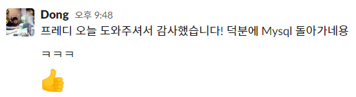

- aws에 배포를 했다. 오래 걸릴 줄 알았는데 생각보다 어렵지는 않았다. 사실 아무것도 모르니까 쉽게 느껴졌을 수도 있겠다. 백그라운드로 프로세스를 실행시켜도 SSH연결이 종료되니 프로세스가 종료되는 현상이 발생했다. Nohup 명령어를 이용하여 실행시키니 문제없이 작동됐다.

  또 하나의 문제점은 로깅이었는데, 일단은 하나의 파일에 계속 덮어씌우고 레벨은 info까지 넣어줬다. 추후에 warning이나 error로 바꿔줘야하지 않을까 싶다.

  DB를 도커로 올리면 안된다는 얘기를 들었는데 이유도 한 번 물어봐야겠다.

  다음 주에는 파이로가 https로 배포하는 방법을 발표해준다고 하는데 기대된다.

  이외에 생각해볼 부분은 elastic ip를 이용해서 도메인 등록을 해보는 것인데, 처음해보는거라 잘 될지 모르겠다.

- 데모 세션을 위해 문서를 정리해봤다. 꼭 문서를 만들어놓지 않더라도 이슈를 잘 만들어놓으니 필요할때 금방 작성할 수 있었다. 마일스톤으로 경계를 나누니 작업의 우선순위도 자연스럽게 정해지는 것 같다. 좀 힘들 것 같다고 생각되는 부분은 api문서였다. 만약에 변동이 일어난다면 맞추기 힘들지 않을까 하는 생각이 들었는데,  api의 변동이 더 자주 일어나게 된다면 스웨거 설정을 먼저 잡아두는게 더 좋을지 고민해봐야겠다. 

  다른 조의 발표에서 인상 깊었던 부분은 json서버와 태그를 달아 버전관리를 하는 것이었다. 태그 다는 것은 고민을 한 번 해봐야겠다.

- 어제 왔던 메세지인데, 너무 기분 좋다. *히히*

  
  