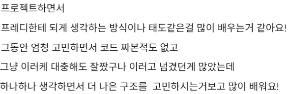

## 09.13

### was1

Message Body를 보다 CRLF Injection과 smuggling을 알게 됐다. 둘 다 리퀘스트에 다른 메세지를 직접 집어넣어 공격하는 방식이었다. 당연히 지금 서버에서는 하나도 고려되지 않았을텐데 테스트케이스를 넣어보며 방어법을 생각해봐야겠다.

## 09.14

몸이 좋지 않아 아무것도 못 했다. 지난주 월화도 몸이 좋지 않았던것 같은데, 주말동안 무리하고 바로 뭘 하려고 해서 그랬던 것 같다. 무리하면 그냥 푹 쉬어주는게 나을 것 같다. 다른 날까지 영향이 가는게 좀 아깝다. 체력도 많이 떨어진 것 같은데 운동도 생각해봐야겠다.

## 09.15

### 알고리즘1

오늘은 DP와 완탐으로 풀 수 있는 문제를 풀었다. 난이도에 비해 시간이 오래 걸렸는데, 깔끔한 점화식에만 익숙해져있다보니 여러 조건을 고려하지 못했다. 하나의 결과가 끝까지 이어지는 것이 아닌, 하나의 결과가 이후 모든 경우의 수에 영향을 미친다. 완전탐색으로도 풀 수 있는 이유가 아마 이 때문인 것 같다. 풀어보길 잘했다.

### was2

오늘은 프록시 학습으로 이어졌다. Content-Length가 올바르지 않은 경우에 대한 설명을 읽었는데, response일 경우 프록시에서 받을때와 클라이언트에서 받을떄 각각에 맞는 처리를 해줘야 한다. 그런데, 프록시에서 어떻게 받아오는지 제대로 설명을 할 수 없었다.

간단한 정의를 내리면 클라이언트가 서버의 자원(resource)에 직접 요청하는 대신, 프록시 서버가 어떠한 자원에 접근할건지 판단(evaluation)해준다. 포워드 프록시와 리버스 프록시로 나뉜다고 한다. 내가 생각하던 프록시는 리버스 프록시였는데, 통상적으로는 포워드 프록시를 얘기한다고 한다.

### 포스트스쿼드1

지난주에 하던 스케줄 후보 조회를 이어서 했다. 컨트롤러 테스트를 완성시키려했는데, MockMVC를 갑자기 다루려니 쉽지 않았다. 게다가 테스트가 중복되느 느낌이다. 컨트롤러 테스트를 하기로 한 이유는 내가 의도하지 않은 형태로 json구조가 만들어지는 것을 확인하기 위함인데, 그에 대한 비용을 치르는 것 치고는 너무 큰게 아닌가 하는 생각도 들었다. 사실 무엇보다 중요한 부분일수도 있지만, 팀원들에게 잘 설득이 될 것 같지도 않았다. 그래서 생각해낸 대안은 문자열을 다루기 편한 그루비로 프로바이더 클래스를 만들어 관리하는 것이었다. 설득은 어느정도 됐는데, Rest Docs가 눈에 들어온다. 내일부터 시도해봐야겠다. 여유가 된다면 둘 다 해보고 싶다.

## 09.16

### 알고리즘2

다른 분들이 풀던 문제를 따라 풀었는데 투포인터 문제들이었다. 첫 문제는 포인터를 한쪽에만 뒀는데, 속도가 안 나와서 이분탐색으로 다시 풀이했다. 결과는, 풀이가 문제가 아니라 스트림을 이용해서 리스트로 변환을 하느라 느린 것이었다.

두 번째 문제는 이분탐색으로 풀이를 시도했는데, 논리적으로 오류가 생긴다. 내일 다시 풀어보자.

### was3

오늘은 코드 작성을 조금 해보기로 했다. 얘기를 하다보니 Attribute를 일급컬렉션으로 리팩토링 하자는 결론이 났다. 일단 진행상황을 킵해두고 해당 작업을 먼저 시작했다.

어떻게 할지 생각을 해보다 rfc문서를 보니 Header와 Status Line의 구현이 약간 달라져야 한다는 것을 인지하고 세부 사항을 보기 위해 해당 파트의 처음부터 문서를 읽어봤다.

결론적으로 계층을 그동안 잘못 생각하고 있다는 것을 알게 됐는데, StatusLine은 Header에 포함되는 개념이 아닌 Message의 필드로 같은 계층에 있어야 한다.

그리고 StatusLine과 Header 사이의 공백에 대한 이슈도 작성되어 있었는데 해당 예외사항을 고려할 수 있도록 추가적인 구현이 필요해보인다.

### 포스트스쿼드2

#### 쿼리 파라미터에서 snake case 사용하기

일단 지금 기능 구현을 마치려고 했는데, 컨트롤러에서 쿼리 파라미터를 제대로 읽지 못했다. 원인은 RequestBody 어노테이션을 붙인 것이 아니라 기본 정책으로 바인딩 되는 것이다.

ArgumentResolver를 선택할때 별도의 설정이 없으면 ServletRequestDataBinder를 사용한다. 이렇게되면 리플렉션을 이용하기 때문에 당연히 잭슨 어노테이션이나 설정은 적용되지 않는다. 예전에 FormData의 리퀘스트에서 날짜를 JsonFormat이 아닌 DateTimeFormat 어노테이션을 사용해야 했던 문제가 있었던 적이 있는데, 그 원인도 이와 동일한 것으로 생각된다.

일단 해당 경우에 ObjectMapper를 사용하도록 ArugmentResolver를 새로 만들어줬다. 트러블슈팅 문서에 기록했는데 따로 포스팅해도 괜찮을 것 같다.

또 다른 문제는 테스트를 하기 힘들다는 것인데, ArgumentResolver는 처리 과정 중간에 있어 따로 빼서 테스트가 힘들 것 같다는 이유였다. 더 생각해보니 의존성을 직접 가져와서 매개변수를 꾸미는 방법을 사용해 볼 수도 있을 것 같다.

추가로 InitBinder를 사용해서 해결하는 방법도 있을 것 같은데 이 것도 고려해봐야겠다. 하지만 이 방법은 글로벌한 설정이 힘들 수 있다는 단점이 있을 것 같다.

#### discusion 관리

discusion이 제대로 관리되지 못하는 느낌을 받았다고 한다. 문제는 여러가지 카테고리들에서 생성된 디스커션이 처리되면 모두 resolve 카테고리로 이동하는 것이 좋지 않아보이는 것이다.

라벨을 이용해서 관리하는 방법을 제시했는데, 나는 해당 문서들은 의견을 주고받는 것과 별개의 문서로 생각하고 있어 어떻게 사용해야 할지 헷갈렸다. 지금 관리되는 디스커션들도 어떤 것들은 이미 트러블 슈팅의 성격을 띠고 있기 때문이다. 따라서 해당 항목이 처리되면 트러블 슈팅 문서를 새로 작성하는 것으로 생각을 하고 있었다. 얘기를 해보니 각각의 카테고리로 관리하는 것이 더 좋다고 생각되었다. 항상 느끼는 것이지만, 코드작성보다 문서작성이 더 힘든 것 같다 😂

#### 협업

커멘트를 남길때 중간 과정을 생략하고 말해 이해하기 힘든 경우가 많다는 피드백을 받았다.

그냥 말로 할때도 그런 경향이 있는데, 대화할때는 해당 부분에서 어떤 부분이 이해가 안 되는지 포인트를 잡고 설명하며 넘어갈 수 있다. 그런데 텍스트로는 그게 쉽지 않다보니 더 심하게 느껴졌나보다. 좀 더 친절하게 커멘트 남기는 연습을 해보자.

그리고 칭찬도 있었다. ㅋㅋ

## 09.17

### was4

어제에 읽어 start line 파트를 읽었다. 구현을 어떻게 해야하는지 친절하게 나와있다. MDN 문서를 보며 개발할때와 확실히 다르다. MDN은 클라이언트 위주의 커멘트가 주로 되어있지만, 스펙에는 서버에 관한 구현도 상세하게 설명해놨다. 예전에는 지도를 돌려가며 맞춰가던 느낌이었다면 지금은 네비게이션이 생긴 느낌이다.

노션도 조금 꾸몄는데, 간만에 재밌었다 ㅋㅋ.

### 포스트스쿼드3

#### DTO 네이밍에 관한 고민

충돌이 나는 DTO가 생겼다. 이유는 좀 common한 이름으로 네이밍 된 DTO를 각자의 작업단위에서 만들어쓰다보니 발생하게 됐다. 여러가지 방법을 생각해봤는데, 일단 사용하는 메소드명을 추가해주는 식으로 네이밍하기로 했다.

이외에 생각해봤던 것들은 패키지단위로 분리해버리는 것이다. 패키지 내부에서 사용하니 크게 신경 쓸 일이 없을 수도 있다. 단점은 같은 이름이 여러개 생기면 import가 복잡해질 수 있다는 것.

두 번째는 내부 클래스로 정의해서 사용하는 것이다. 네임스페이스가 자연스럽게 묶인다. 단점은 너무 많아지면 관리가 복잡해질 수 있을 것 같다.

#### 테스트 트랜잭션

Entity Manager를 사용하려면 Transactional 어노테이션이 필요하다. 아무 생각 없이 테스트 코드에서 직접 주입하여 사용하고 있었다. 당연히 클래스 상단에 Transactional 어노테이션도 붙어있다.

테스트를 실행하면 당연히 제대로 동작하지 않는다. given 페이즈에서 넣어준 데이터를 조회할 수 없다. 트랜잭션이 걸려있으니 당연한 결과였다.

일단은 entityManager를 따로 관리해주는 클래스를 임시로 만들어 해결했는데, 추가적인 설정이 있어야 더 편하게 사용할 수 있을 것 같다.

어노테이션을 그대로 붙이고 isolation 레벨을 read uncommitted로 바꿔 시도해봤는데 동작하지 않았다. 이건 더 공부해봐야겠다.

#### 양방향 매핑

양방향 매핑이 제대로 되지 않아 관계테이블이 만들어지고 있었다. 양방향 매핑시에 주종관계를 선언해줘야 하는데 이걸 빼먹고 있었다. JPA를 너무 오랜만에 하니 기억이 잘 안 난다 ㅎㅎㅎ... 공부하자
